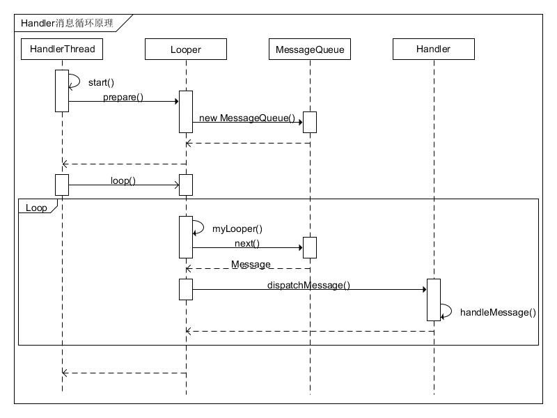

# Handler原理

information | details
------------|--------
date | 2019-03-08

## 时序图



### 时序图源码

```
title: Handler消息循环原理

HandlerThread~id1|Looper~id2|MessageQueue~id3|Handler~id4

id1->id1:id1:start()
id1->>>id2:id1,id2:prepare()
id2->>>id3:id2,id3:new MessageQueue()
id3.>id2
id2.>id1
id1->id2:id1,id2:loop()
iframe{:Loop
id2->>>id2:id2:myLooper()
id2->>>id3:id2,id3:next()
id3.>id2:Message
id2->>>id4:id2,id4:dispatchMessage()
id4->>>id4:id4:handleMessage()
id4.>id2
iframe}
id2.>id1
```

## 总结

HandlerThread是一个包含Looper对象的特殊线程，通过Java的ThreadLocal机制，每个线程都有一个独一无二的Looper对象，而每一个Looper都维护着一个消息队列，这个消息队列内部加了互斥锁，保证了线程安全，所以线程间通信的数据可以统统流经这个消息队列，而最终处理消息的对象就是常见的Handler，这是面向用户的接口，在里面可以放心的拿数据，不用考虑线程安全问题，对于发送的一方，也是通过Handler发送消息给队列，对于用户来说完全不用管线程安全的问题，大大方便了线程间的通信。